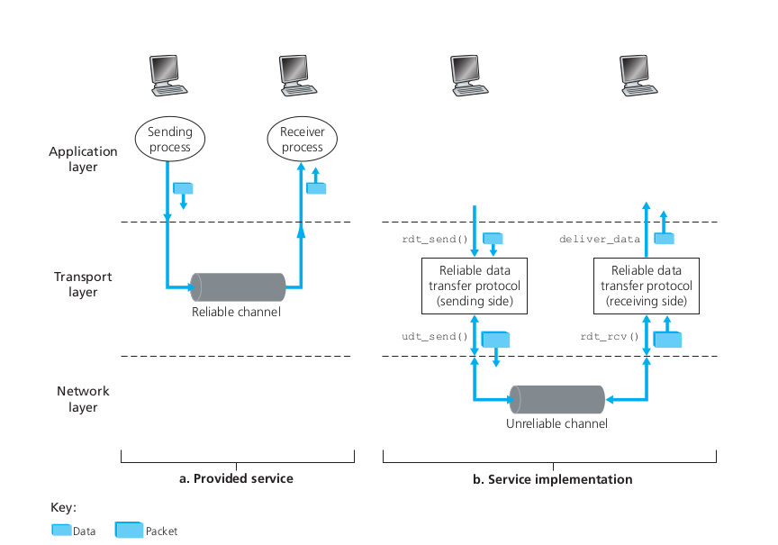
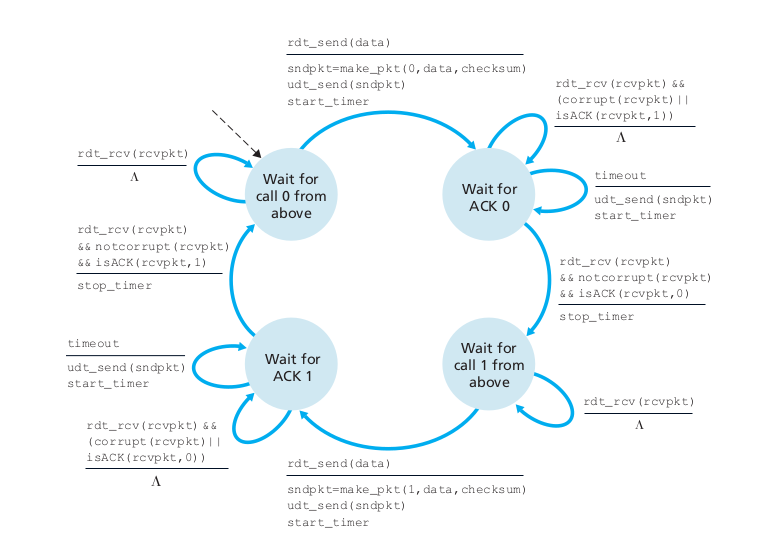
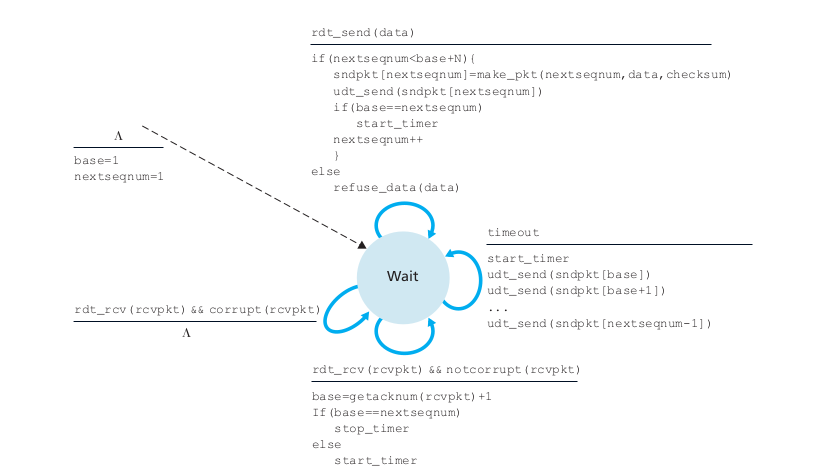
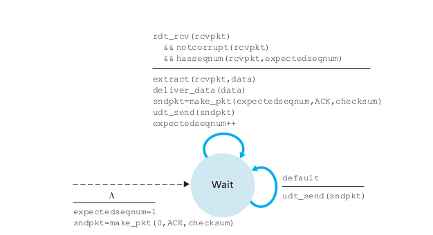

# RealiableUDP
## Description
The most famous relable transport layer protocol is TCP. This project simulates a reliable data transfer protocol by implementing
a reliable layer on top of UDP. The reliable layer is implemented as an application layer protocol as implementing it as a transport layer protocol would require changing the OS code. Our approach uses two schemes, the go back n scheme and the stop and wait scheme.
## Introduction 
The figure below illustrates the reliable data transfer. The
service abstraction provided to the upper-layer entities is that of a reliable channel
through which data can be transferred. With a reliable channel, no transferred data
bits are corrupted (flipped from 0 to 1, or vice versa) or lost, and all are delivered in
the order in which they were sent. This is precisely the service model offered by TCP
to the Internet applications that invoke it.

### Stop and Wait
The following figure is the finite state machine of the stop and wait sender

### Go-Back-N (GBN)
In a Go-Back-N (GBN) protocol, the sender is allowed to transmit multiple packets
(when available) without waiting for an acknowledgment, but is constrained to have
no more than some maximum allowable number, N, of unacknowledged packets in
the pipeline.The following figures show the finite state machines of the sender and reciever GBN

## Technical Specifications
* C++ 17
* CMake minimum required version 3.7.1
## References
[1] Kuros, Ross 2017, Computer Networking – A top down approach 6th edition, Boston Massachusetts, and New York

